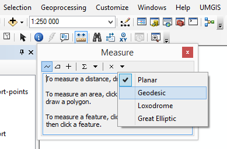

## ArcGIS and geodesic

### Buffer
ArcGIS The [Buffer](http://resources.arcgis.com/en/help/main/10.1/index.html#//000800000019000000) tool creates true geodesic buffers for line and polygon input data since version 10.2. Prior to 10.1, only input point features would create geodesic buffers.  
[More info...](http://resources.arcgis.com/en/help/main/10.1/index.html#//016w0000002s000000)

### Measure tool
ArcGIS The [Measure tool](http://help.arcgis.com/en/arcgisdesktop/10.0/help/index.html#//00s500000022000000) lets you measure geodesic line - the shortest line between any two points on the earth's surface on a spheroid (ellipsoid). One use for a geodesic line is when you want to determine the shortest distance between two cities for an airplane's flight path. This is also known as a great circle line if based on a sphere rather than an ellipsoid.  
.

### Copy parallel line
ArcMap offers also [Copying parallel line](http://resources.arcgis.com/en/help/main/10.1/index.html#//01m700000028000000) tool. It allow  You to specify the method for how corners are created:
* The beveled option adds a line segment to create a beveled corner. 
* The mitered option extends line segments until they intersect. 
* The rounded option adds a curved segment at the corner.
